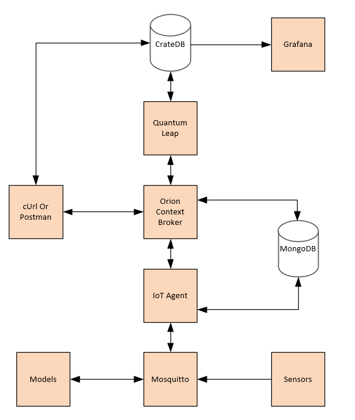
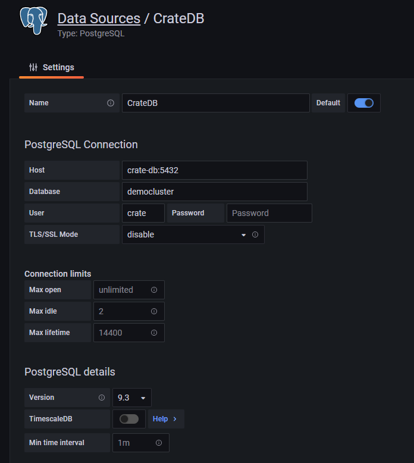
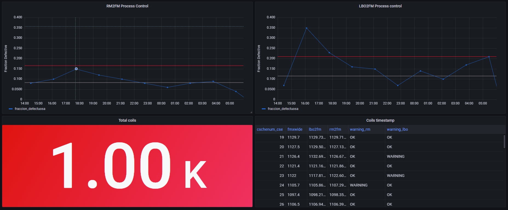

This repository shows a demo using the [FIWARE framework](https://www.fiware.org/) for process control in a factory. This control will be performed by sensor monitoring and predictions made by previously trained models.

## Contents

<details>
<summary><strong>Expand</strong></summary>

-   [Architecture](#architecture)
-   [Prerequisites](#prerequisites)
-   [Checking services status](#checking-services-status)
-   [Entities](#entities)
-   [Suscriptions](#suscriptions)
-   [Mosquitto](#mosquitto)
-   [Grafana](#grafana)
-   [Model](#model)
-   [Sensors](#sensors)

</details>

# Architecture

This application makes use of three FIWARE components: Orion Context Broker, IoT Agent and QuantumLeap. Usage of the Orion Context Broker is sufficient for an application to qualify as "Powered by FIWARE". Both the Orion Context Broker and the IoT Agent rely on open source MongoDB technology to keep persistence of the information they hold.

On the other hand, the simulated sensors and models will use an MQTT broker to send their data to the FIWARE framework and allow their storage and analysis by users through third party tools such as Crate-DB, Grafana and cURL or Postman.

Therefore the overall architecture will consist of the following elements:

-   FIWARE [Orion Context Broker](https://fiware-orion.readthedocs.io/en/latest/): handles requests via
    [NGSI-v2](https://swagger.lab.fiware.org/?url=https://raw.githubusercontent.com/Fiware/specifications/master/OpenAPI/ngsiv2/ngsiv2-openapi.json)
-   FIWARE [IoT Agent for JSON](https://fiware-iotagent-json.readthedocs.io/en/latest/)listen to the MQTT Broker on registered topics to send measurements to Orion and convert them in NGSI-v2
-   FIWARE [QuantumLeap](https://quantumleap.readthedocs.io/en/latest/): subscribed to context changes and persisting them into a CrateDB database
-   [MongoDB](https://www.mongodb.com/) database: used by the Orion Context Broker to hold context data information such as data entities y subscriptions. Also used by the IoT Agent to hold device information such as device URLs and Keys
-   [CrateDB](https://crate.io/) database: hold time-based historical context data
-   [Mosquitto](https://mosquitto.org/) MQTT broker: acts as a central communication point, passing MQTT topics between the IoT Agent and IoT devices as necessary
-   Sensors: Simulates real-world sensor operation generating data every X amount of time
-   Models: Contains previously trained models to make predictions based on data collected by sensors
-   [Grafana](https://grafana.com/): Analyses and visualisations of time series data
 
The data flow used can be seen in the diagram and will be described throughout this README.



# Prerequisites

All components will be run using [Docker](https://www.docker.com/). The installation required for deployment is:

-   Server Ubuntu 21.04
-   Administrator user in Ubuntu server
-   SFTP enabled and SFTP client
-   Docker 20.10.9 and docker Compose 1.25 installed

# Checking services status

The necessary configuration for wiring up all services are in the associated docker-compose.yml file. After using the **docker compose up command** with the above mentioned file you should check that all containers have the status Up with the **docker ps –a command**. 

We can now specifically check whether the essential services are working properly in the following ways. X.X.X.X refers the IP of Ubuntu server.

From web browser:

-   Orion Context Broker: http://X.X.X.X/:1026/version
-   QuantumLeap: http://X.X.X.X/:8668/version
-   CrateDB: http://X.X.X.X/:4200
-   Grafana: http://X.X.X.X/:3000

From temporary containers for Mosquitto:

-   First terminal from suscriber: 

```console
sudo docker run -it --rm --name mqtt-subscriber --network soon_soon efrecon/mqtt-client sub -h mosquitto -t "/#"
```

-   Second terminal for publisher: 

```console
sudo docker run -it --rm --name mqtt-publisher   --network soon_soon efrecon/mqtt-client pub -h mosquitto -m "SOOntestMessage" -t "/test"
```

From cURL:

-   IoT Agent

```console
curl -X GET \
  'http://X.X.X.X:4041/iot/about'
```

If any of the tests performed in this section fail, it will be necessary to review logs generated through **docker logs** and use the official documentation associated to each specific service to solve the problem.

# Entities

In the FIWARE platform, an entity represents the state of a physical or conceptual object which exists in the real world. 

FIWARE is a framework managing context information. The context data of that entity defines the state of that real-world object at a given moment in time.

Entities have two mandatory attributes: id and type. It is recommended that the id follows NGSI-lD guidelines (urn:ngsi-ld:<entity-type>:<entity-id>) to be unique. Additional attributes are optional and will depend on each specific use case, but all of them should include type and value. Further information in the [official documentation](https://fiware-orion.readthedocs.io/en/1.4.0/admin/database_model/index.html).

For this demo, the 4 necessary entities are located in the entities folder. These JSON type files represent the entities that must be created by POST requests made against the Orion Broker. Each entity will be composed of different sensors or model predictions. A sample request:

```console
curl -iX POST \
  'http://X.X.X.X:1026/v2/entities' \
  -H 'Content-Type: application/json' \
  -d '{
    "id": "urn:ngsi-ld:Rm:001",
    "type": "Rm",
    "cschenum_cseqnum": {
        "type": "Integer",
        "value": "1"
    },
	"fsmofs_wfd": {
        "type": "Float",
        "value": "-30.1"
    },
	"rmxwide": {
        "type": "Float",
        "value": "1280"
    },
	"fsusgt": {
        "type": "Float",
        "value": "19"
    },
	"cchcom_1": {
        "type": "Float",
        "value": "100"
    },
	"cchcom_2": {
        "type": "Float",
        "value": "2200"
    },
	"cchcom_3": {
        "type": "Float",
        "value": "53"
    },
	"cchcom_4": {
        "type": "Float",
        "value": "140"
    },
	"cchcom_5": {
        "type": "Float",
        "value": "10"
    },
	"cchcom_6": {
        "type": "Float",
        "value": "190"
    },
	"cchcom_7": {
        "type": "Float",
        "value": "370"
    },
	"cchcom_8": {
        "type": "Float",
        "value": "30"
    },
	"cchcom_9": {
        "type": "Float",
        "value": "43"
    },
	"cchcom_10": {
        "type": "Float",
        "value": "140"
    },
	"cchcom_11": {
        "type": "Float",
        "value": "4"
    },
	"cchcom_12": {
        "type": "Float",
        "value": "16"
    },
	"cchcom_13": {
        "type": "Float",
        "value": "8"
    },
	"cchcom_14": {
        "type": "Float",
        "value": "6"
    },
	"cchcom_15": {
        "type": "Float",
        "value": "15"
    },
	"cchcom_16": {
        "type": "Float",
        "value": "25"
    },
	"cchcom_17": {
        "type": "Float",
        "value": "20"
    },
	"cchcom_18": {
        "type": "Float",
        "value": "67"
    },
	"cchcom_19": {
        "type": "Float",
        "value": "1"
    },
	"cchcom_20": {
        "type": "Float",
        "value": "1"
    },
	"cchcom_22": {
        "type": "Float",
        "value": "29"
    },
	"cchcom_24": {
        "type": "Float",
        "value": "0"
    },
	"cchcom_25": {
        "type": "Float",
        "value": "0"
    },
	"medtmprm": {
        "type": "Float",
        "value": "1006.5"
    },
	"pesobob": {
        "type": "Float",
        "value": "14596.9"
    },
	"medtmpbo": {
        "type": "Float",
        "value": "674.3"
    },
	"medtmpf6": {
        "type": "Float",
        "value": "810.4"
    },
	"medtmptij": {
        "type": "Float",
        "value": "1055.9"
    },
	"medtmpvs": {
        "type": "Float",
        "value": "1073.5"
    },
	"tmfb": {
        "type": "Float",
        "value": "771.9"
    },
	"tfemt": {
        "type": "Float",
        "value": "1056.5"
    },
	"tfent": {
        "type": "Float",
        "value": "1077.3"
    },
	"tfenta": {
        "type": "Float",
        "value": "1080.5"
    },
	"tfexds": {
        "type": "Float",
        "value": "790"
    },
	"tfexpr": {
        "type": "Float",
        "value": "819.2"
    },
	"texitf": {
        "type": "Float",
        "value": "813.7"
    },
	"timhea": {
        "type": "Float",
        "value": "2020"
    },
	"texiti": {
        "type": "Float",
        "value": "673.2"
    },
	"tcdes": {
        "type": "Float",
        "value": "550"
    },
	"sumarxpytab": {
        "type": "Float",
        "value": "1052.5"
    },
	"pfbfrc": {
        "type": "Float",
        "value": "8987.7"
    },
	"pfbtmp": {
        "type": "Float",
        "value": "1117.42"
    }
}
'
```

Once the entities have been created, the values of each attribute can be updated via PATCH requests to the broker. Example: PATCH to http://X.X.X.X:1026/v2/entities/urn:ngsi-ld:ModeloRM:001/attrs with de folowing JSON Body:

```json
{
    "cschenum_cseqnum": {
        "type": "Integer",
        "value": "2"
    },
	"rm2fm": {
        "type": "Float",
        "value": "1272.776687"
    },
	"fmxwide": {
        "type": "Float",
        "value": "1272.5"
    }
}
```

All created entities can be checked with a GET request to the broker http://X.X.X.X:1026/v2/entities.

# Suscriptions

The Orion Context Broker subscription mechanism works in such a way that every time an entity is updated, it sends the data defined in the subscription to a user-defined application (API, application, web service, ...). In other words, OCB determines when a change in information has occurred and notifies a third application asynchronously.

In this demo the subscriptions will send the updated data to the QuantumLeap API, which is responsible for storing this information in Crate-db, a time series database.

In the subscriptions folder there is a subscription in JSON format for each of the entities created in the previous step.

Subscriptions should contain a pattern and a group to identify the entities responsible for updating information to third parties.  Changes shall only be notified when there are changes to the attributes declared in condition.attrs. The attributes to be included in such notification for storage are those indicated in notification.attrs.

An example of the POST notification sent to the context bróker http://X.X.X.X:1026/v2/subscriptions

```json
{
	"description": "Suscripcion QuantumLeap Lbo",
	"subject": {
		"entities": [
		  {
			"idPattern": ".*",
			"type": "Lbo"
		  }
		],
		"condition": {
		  "attrs": [
			"cschenum_cseqnum"
		  ]
		}
	},
	"notification": {
		"attrs": [
			"cschenum_cseqnum",
			"dspyfx_1",
			"dspyfx_2",
			"dspyfx_3",
			"dspyfx_4",
			"dspyfx_5",
			"dspyfx_6",
			"dspyfx_7",
			"dspyfx_8",
			"dspyfx_9",
			"dspyfx_10",
			"dspyfx_11",
			"dspyfx_12",
			"dspyfx_13",
			"dspyfx_14",
			"dspyfx_15",
			"dspyfx_16",
			"dspyfx_17",
			"dspyfx_18",
			"lbowide"
		],
		"http": {
			"url": "http://quantumleap:8668/v2/notify"
		}, 
		"metadata": [ 
			"dateCreated", 
			"dateModified" 
		] 
	}
}
```

All active subscriptions can be retrieved via a GET request http://X.X.X.X:1026/v2/subscriptions

# Mosquitto

Mosquitto is a open source MQTT broker which will be used during this demo. MQTT is a publish-subscribe-based messaging protocol used in the internet of Things. The goal is to provide a protocol, which is bandwidth-efficient and uses little battery power.

In this protocol, each client that publishes a message to the broker, includes a topic into the message. The topic is the routing information for the broker. Each client that wants to receive messages subscribes to a certain topic and the broker delivers all messages with the matching topic to the client. Therefore the clients don’t have to know each other, they only communicate over the topic. 

Given the diversity of sensors in terms of manufacturers and level of complexity that may exist in a factory, it is necessary to unify their communication with the formats accepted by FIWARE. The IoT Agent is responsible for acting as an intermediate gateway, acting as an intermediary between Mosquitto and the Orion context broker. In this way, sensors can be connected at any time and will only have to be configured to send their measurements via the topic chosen for communication in Mosquitto, thus abstracting from the higher level provided by FIWARE. This approach greatly enhances scalability.

It is required to include the following configuration in the mosquitto.conf file present in the mosquitto/config folder of the docker container responsible for Mosquitto


```console
persistence false
connection_messages true
allow_anonymous true
listener 1883 0.0.0.0
```

For simplicity, the topic used for communications makes use of the wildcard /#.

# Grafana

Grafana is an open source data visualisation tool commonly used in infrastructure monitoring such as sensors, automation, environmental conditions and process control. It offers a web interface for the creation of time series based graphical components.

The interface is accessed via a web browser with the url http://X.X.X.X:3000/. The default username and password are admin.

To add a data source in Grafana that allows us to make representations, we must choose one that is compatible with the Crate-db database, which in this case will be the PostgreSQL type. And the following configuration will be done:



In the graphics folder you will find exported example process control graphics in JSON format that can be imported.

These example graphs check how many estimation errors have occurred in the process of producing coils in consecutive batches of 100 coils. The SQL statements that allow the necessary data to be obtained from the Crate-db database for such a representation are:

```console
SELECT avg(time_index) as time,SUM(case when ABS(CAST(rm2fm as double)-CAST(fmxwide as double)) > 0.9939 THEN 1.00 else 0.00 end)/100 as fraccion_defectuosa from "doc"."etmodelorm" group by (cschenum_cseqnum-1)/100 order by time;
```

```console
SELECT avg(time_index) as time,SUM(case when ABS(CAST(lbo2fm as double)-CAST(fmxwide as double)) > 2.781 THEN 1.00 else 0.00 end)/100 as fraccion_defectuosa from "doc"."etmodelolbo" group by (cschenum_cseqnum-1)/100 order by time;
```



# Model

As part of the SOON project, we have developed two Random Forest models in Python to predict the widths of the coils at different points in the industrial process based on measurements made by multiple sensors. 

It has been saved using pickle, which is an integrated Python module used to serialise and deserialise the structure of an object in Python. It is loaded using the files in the models folder:

```console
import pickle
import pandas as pd
model = pickle.load(open(filename, 'rb'))
```

And to predict with it, we used series, frames and a dataframe, being args an array with the entries needed to caculate the output with the model, we use it in the following way:

```console
serie = pd.Series([args[0]])
serie1 = pd.Series([args[1]])
serie2 = pd.Series([args[2]])
serie3 = pd.Series([args[3]])
serie4 = pd.Series([args[4]])
serie5 = pd.Series([args[5]])
serie6 = pd.Series([args[6]])
serie7 = pd.Series([args[7]])
....
frame = {'FSMOFS_WFD':serie,'RMXWIDE':serie1,'FSUSGT':serie2,'CCHCOM_1':serie3,'CCHCOM_2':serie4,'CCHCOM_3':serie5,
            'CCHCOM_4':serie6,'CCHCOM_5':serie7,'CCHCOM_6':serie8,'CCHCOM_7':serie9,'CCHCOM_8':serie10,'CCHCOM_9':serie11,
            'CCHCOM_10':serie12,'CCHCOM_11':serie13,'CCHCOM_12':serie14,'CCHCOM_13':serie15,'CCHCOM_14':serie16,
            'CCHCOM_15':serie17,'CCHCOM_16':serie18,'CCHCOM_17':serie19,'CCHCOM_18':serie20,'CCHCOM_19':serie21,
            'CCHCOM_20':serie22,'CCHCOM_22':serie23,'CCHCOM_24':serie24,'CCHCOM_25':serie25,'MEDTMPRM':serie26,
            'PESOBOB':serie27,'MEDTMPBO':serie28,'MEDTMPF6':serie29,'MEDTMPTIJ':serie30,'MEDTMPVS':serie31,'TMFB':serie32,
            'TFEMT':serie33,'TFENT':serie34,'TFENTA':serie35,'TFEXDS':serie36,'TFEXPR':serie37,'TEXITF':serie38,'TIMHEA':serie39,
            'TEXITI':serie40,'TCDES':serie41,'SUMARXPYTAB':serie42,'PFBFRC':serie43,'PFBTMP':serie44}
dframe = pd.DataFrame(frame)
predictions = model.predict(dframe)
```

Predictions is an array with the results for the different entries in dframe, in this case, as there is only one entry, the result is in predictions[0].

# Sensors

As this is a docker-based development environment, the sensors that are part of this simulated architecture are not real devices sending data. 

This is why the sensors container exists. Inside it, the obtaining of measurements by each of the sensors to be able to execute the models and update the entities created in the orion context broker by means of POST requests should be simulated. 